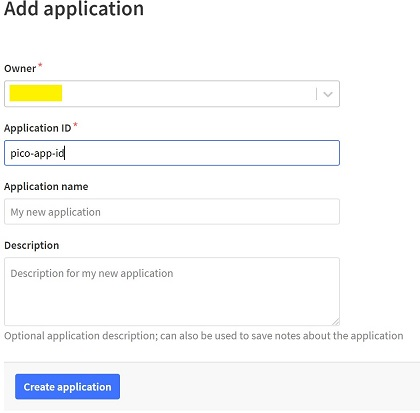
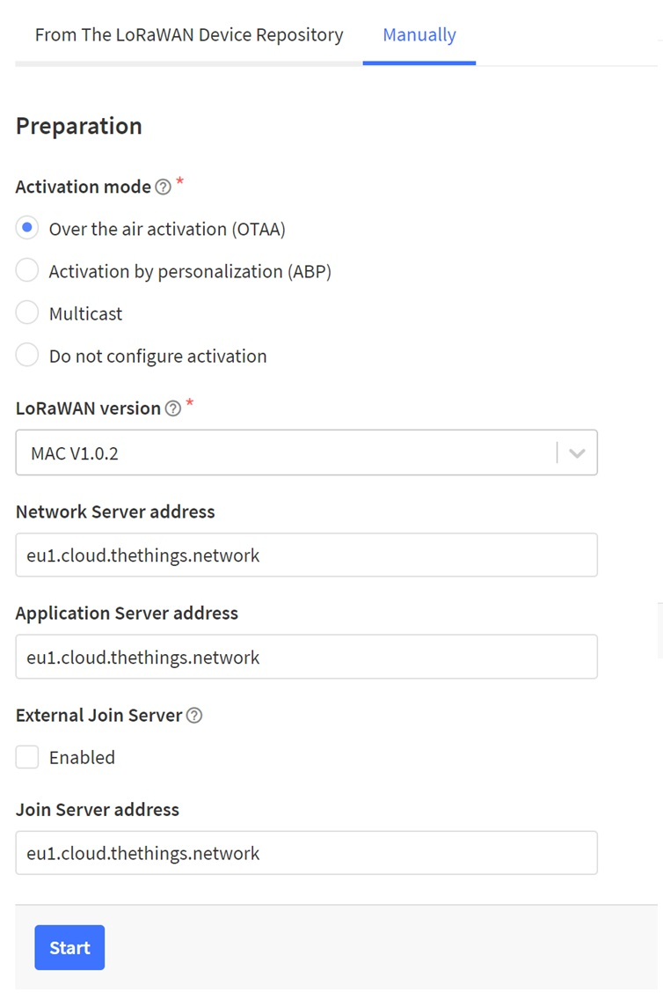
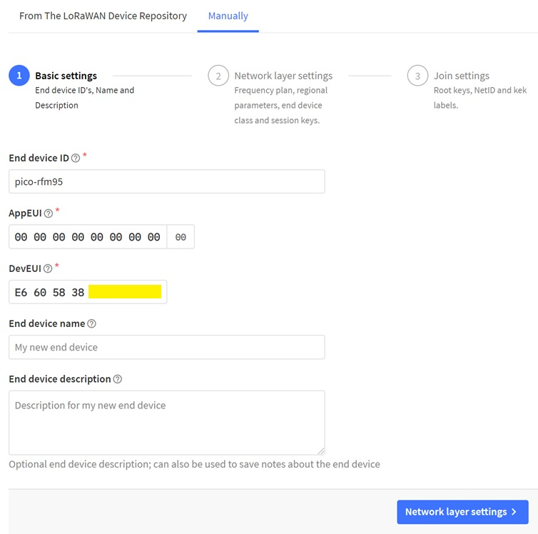
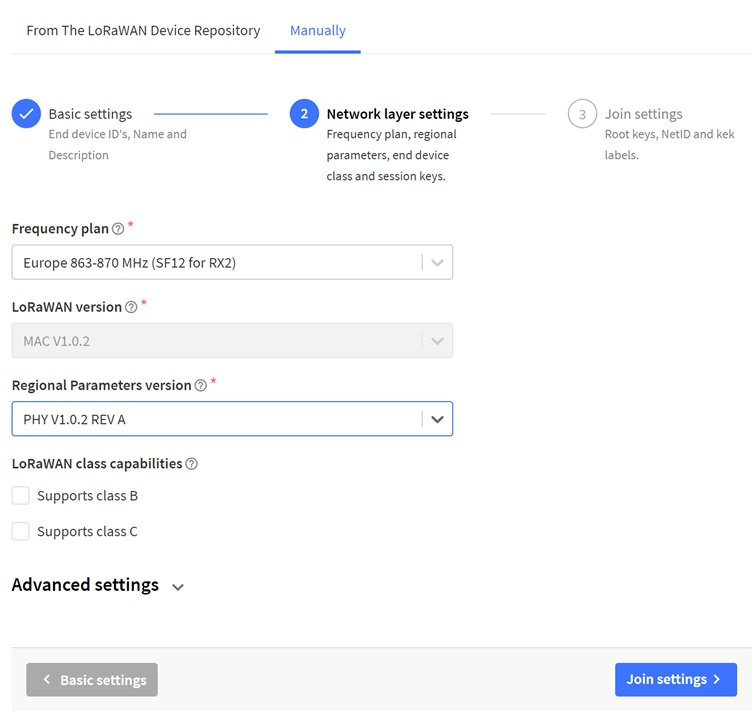
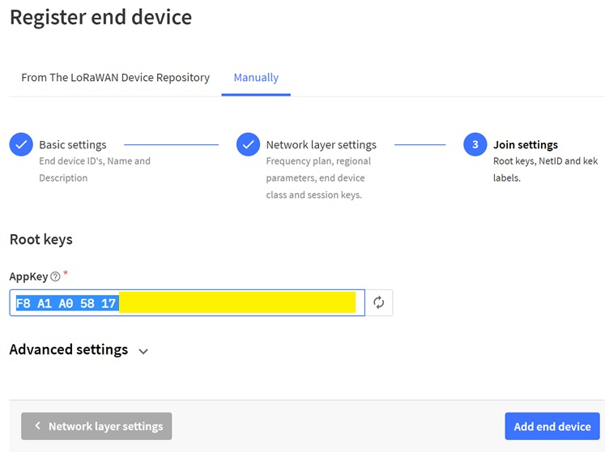
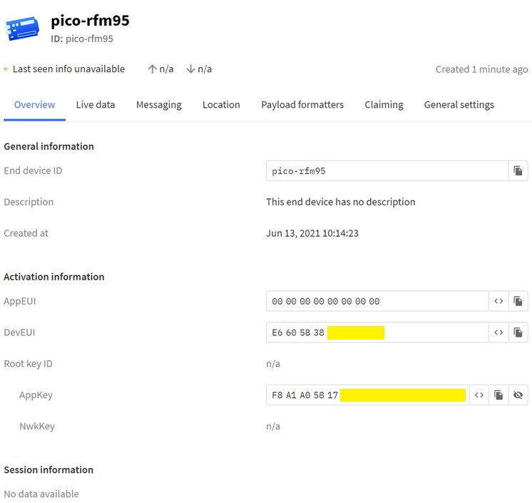

# LoRaWAN, Raspberry Pi Pico, HOPERF Module RFM95W, The Things Network V3

## Overview

This guideline is based on excellent article from Sandeep Mistry: 
[Connect Your Adafruit Feather RP2040 to The Things Network](https://www.hackster.io/sandeep-mistry/connect-your-adafruit-feather-rp2040-to-the-things-network-5c0c84)
and another one from Alasdair Allan
[How to add LoRaWAN to Raspberry Pi Pico](https://www.raspberrypi.org/blog/how-to-add-lorawan-to-raspberry-pi-pico/)

The difference from those articles is to provide guideline for:

- European region
- HOPERF Module based on RFM95W - I'm happy owner of [RFM95W-868-S2_BOB](https://www.soselectronic.com/products/various/rfm95w-868-s2-bob-342652)

Goal is to provide guideline how to make all those components work Together in European region with The Things Network.

## Source code and Build

I'm assuming you have Raspberry Pi Pico C/C++ SDK installed. In my case I have it in my home directory: ~/pico/pico-sdk.

```
git clone --recurse-submodules https://github.com/sandeepmistry/pico-lorawan.git
```

Do few changes in the source code to support European region.
In Examples directory change in all three config.h files values from
```
#define LORAWAN_REGION                  LORAMAC_REGION_US915
```
to
```
#define LORAWAN_REGION                  LORAMAC_REGION_EU868
```

In the root directory change the CMakeLists.txt file value from
```
target_compile_definitions(pico_loramac_node INTERFACE -DACTIVE_REGION=LORAMAC_REGION_US915)
```
to
```
target_compile_definitions(pico_loramac_node INTERFACE -DACTIVE_REGION=LORAMAC_REGION_EU868)
```

and build with:

```
cd pico-lorawan
mkdir build && cd build && cmake -DPICO_SDK_PATH=~/pico/pico-sdk -DCMAKE_BUILD_TYPE=Debug -DPICO_BOARD=pico .. && make -j4
```

## Get Dev EUI

Raspberry Pi Pico with HOPERF Module with RFM95W doesn't have DevEUI allocated.
You need to get DevEUI from Raspberry Pi Pico board via. unique id of the board.

Upload example application "default_dev_eui" which can do this and connect terminal to see the result.

I use SWD interface and openocd tool to upload applications into Raspberry Pi Pico.

```
openocd -f interface/raspberrypi-swd.cfg -f target/rp2040.cfg -c "program  examples/default_dev_eui/pico_lorawan_default_dev_eui.elf verify reset exit"

minicom -b 115200 -o -D /dev/ttyACM0
```

In my case the result is:
```
DevEUI:E6605838XXXXXXXX
```

Note: Value 'XXXXXXXX' was redacted to not show complete identifier of the board.

## Wiring

HOPERF Module Pin Name | Raspberry Pi Pico GPIO | Raspberry Pi Pico Pin Number
--- | --- | ---
VCC 3.3V * | 3v3(OUT) | 36
GND ** | GND | 38
DI01 | GPIO 10 | 14
DI00 | GPIO 7 | 10
MISO | GPIO 16 | 21
MOSI | GPIO 19 | 25
SCK | GPIO 18 | 24
nSS | GPIO 8 | 11
RST | GPIO 9 | 12

VCC 3.3V * - The last bottom pin at the right side from antenna when antenna is oriented at the top side.

GND ** - The last top pin at the right side from antenna when antenna is oriented at the top side.

For more details see [HopeRF RFM95 breakout pinout](https://reuben.honigwachs.de/post/rfm95-breakout-board/)

## The Things Network Device Enrollment

I'm assuming you are familiar with The Things Network and you have an account which you can use.

Go to the [The Things Stack Community Edition Console](https://console.cloud.thethings.network/) and select Europe 1 region.
After logging in go to the applications.

Click "Add Application", specify some application ID and hit "Create Application".



Next, click "Add end device", select tab "Manually", keep option "Over the air activation (OTAA)",
select "MAC V1.0.2" as the LoRaWAN Version.
Click "Start".



Next, name the device somehow ("End device ID" field).
Click "00" button next to the AppEUI field.
and use your DevEUI you obtained from "default_dev_eui" app.
Hit "Network layer settings" button.



Next, select the "Europe 863-870 MHz (SF12 for RX2)" as a frequency plan and the "Regional Parameters version" set to "PHY V1.0.2 REV A".
Then click the "Join settings" button.



Next, Click the button next to the AppKey to generate an AppKey, then click the "Add end device" button.



This generated AppKey: F8A1A05817XXXXXXXXXXXXXXXXXXXXXX for me.

Note: Value 'XXXXXXXX' was redacted to not show complete identifier.

Now the device has been added. You will need values of fields AppEUI/JoinEUI, DevEUI and AppKey later.



## Configure Apps Settings

In all config.h files where applicable, change value from
```
#define LORAWAN_DEVICE_EUI      "0000000000000000"
```
to
```
#define LORAWAN_DEVICE_EUI      NULL
```

For define JoinEUI/AppEUI keep all zeroes - no change.

Change AppKey from zeroes to obtained AppKey.
In my case:
```
#define LORAWAN_APP_KEY         "F8A1A05817XXXXXXXXXXXXXXXXXXXXXX"
```

Note: Value 'XXXXXXXX' was redacted to not show complete identifier.

If you want to enable debug messages, change/uncomment in main.c files
```
// uncomment next line to enable debug
lorawan_debug(true);
```
